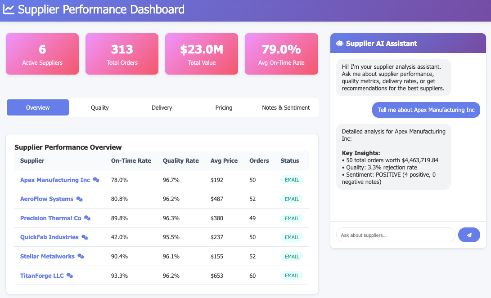

# Supplier Performance Dashboard

A comprehensive supplier analysis dashboard with AI-powered chatbot for manufacturing procurement decisions.

## Dashboard Preview



## Features

### 1. Supplier Dashboard
- **Quality Metrics**: Inspection results, rejection rates, rework requirements
- **Delivery Performance**: On-time delivery rates, delay analysis
- **Pricing Analysis**: Quote comparisons, lead time analysis
- **Supplier Notes**: Performance insights and recommendations

### 2. AI Chatbot
- Natural language queries about supplier performance
- Supplier recommendations based on composite scoring
- Quality and delivery analysis
- Pricing comparisons

### 3. Visualizations
- Interactive charts for quality trends
- Delivery performance metrics
- Pricing vs lead time analysis
- Supplier performance overview table

## Technology Stack

- **Backend**: Node.js, Express.js
- **Database**: SQLite (in-memory)
- **Frontend**: HTML5, CSS3, JavaScript, Chart.js
- **AI/LLM**: Rule-based chatbot (extensible to LlamaIndex + Vertex AI)

## Installation

1. **Clone and setup**:
```bash
cd sa-work
npm install
```

2. **Start the application**:
```bash
npm start
```

3. **Access the dashboard**:
Open http://localhost:3000 in your browser

## Data Sources

The application loads data from CSV files:
- `quality_inspections.csv`: Quality control data
- `rfq_responses.csv`: Request for Quote responses
- `supplier_orders.csv`: Purchase order history
- `supplier_notes.txt`: Performance notes and insights

## API Endpoints

- `GET /api/dashboard` - Dashboard summary data
- `GET /api/suppliers` - List of suppliers
- `GET /api/suppliers/:name` - Supplier details
- `POST /api/chat` - Chatbot interaction
- `GET /api/quality-trends` - Quality metrics over time
- `GET /api/delivery-performance` - Delivery metrics over time

## Chatbot Capabilities

Ask questions like:
- "Who is the best supplier?"
- "Show me quality metrics"
- "Which supplier has the best delivery performance?"
- "Tell me about QuickFab Industries"
- "Compare pricing between suppliers"

## Supplier Insights

### Gold Standard Suppliers
- **Stellar Metalworks**: Never missed delivery, zero rework
- **Precision Thermal Co**: Electronics expert, excellent technical support

### Caution Suppliers  
- **QuickFab Industries**: Repeated delays, quality issues (8/9 orders late)

### Reliable Suppliers
- **Apex Manufacturing**: Solid B+ performance, 85-90% on-time
- **TitanForge LLC**: Motor specialist, excellent for 3-10HP units
- **AeroFlow Systems**: Air handling specialist, accurate lead times

## Future Enhancements

1. **LLM Integration**: 
   - Replace rule-based chatbot with LlamaIndex + Vertex AI
   - Add document embedding for supplier notes
   - Natural language SQL query generation

2. **Advanced Analytics**:
   - Predictive delivery modeling
   - Cost optimization recommendations
   - Risk assessment scoring

3. **Real-time Data**:
   - Live data feeds from ERP systems
   - Automated quality alerts
   - Performance notifications

## Development

### Adding New Suppliers
Update the `supplier_notes` table in `database.js` with new supplier information.

### Extending Chatbot
Modify `chatbot.js` to add new query patterns and responses.

### Custom Visualizations
Add new charts in `dashboard.js` using Chart.js library.

## License

MIT License - See LICENSE file for details.